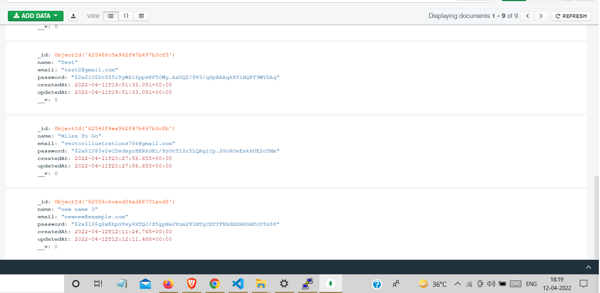
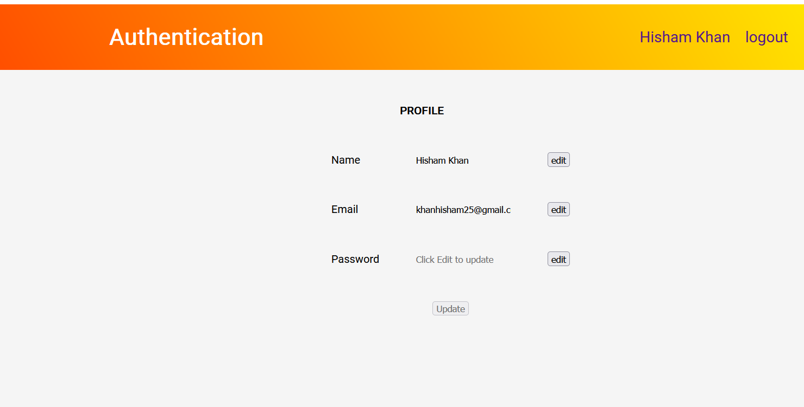

# Simple Authentication

it can be used as a starter code for creating any new
application , almost every application needs Authentication in their app
built upon node js express and mongoDb

## Screenshots

    Saved encrypted password 

    password can be changed from here after signing in

## Features

- Google Signing in and Signing Up
- Reset Forgot Password by getting through mails
- Edit Profile After Signed in (name,email & Password)
- Does notifies on almost every event
- Save Passwords encrypted only

